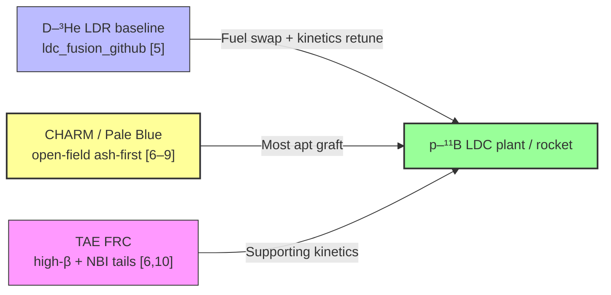
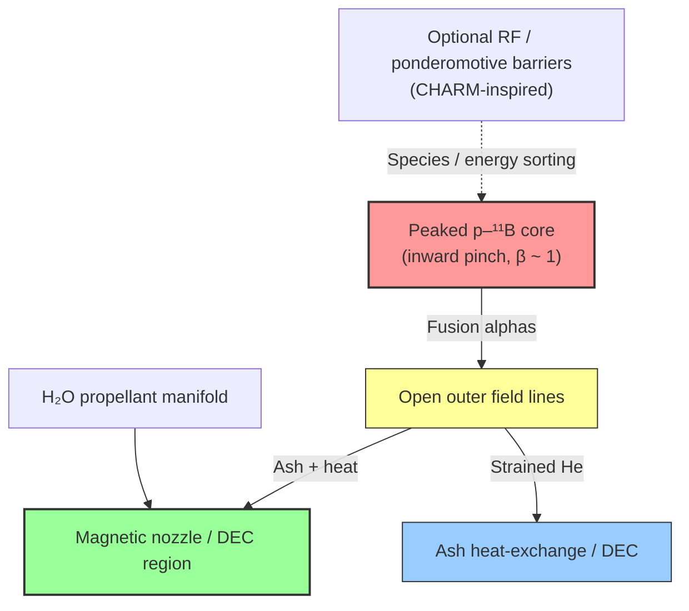
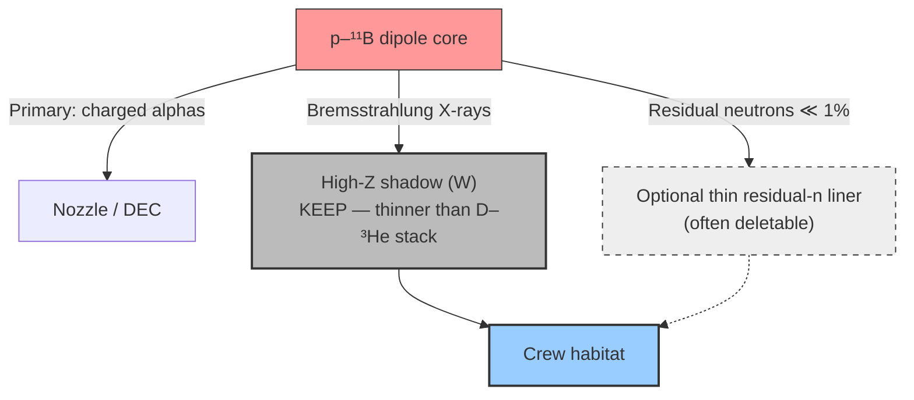
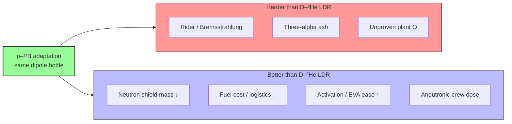

# Adapting the $D\text{-}^{3}\text{He}$ Levitated Dipole Rocket to $p\text{-}^{11}\text{B}$ for an Aneutronic Power Plant with Reduced Astronaut Shielding

## Abstract
The **Deuterium–Helium-3 ($D\text{-}^{3}\text{He}$) Levitated Dipole Rocket (LDR)** is a systems-level *conceptual* architecture for crewed interplanetary propulsion: a high-$\beta$ magnetospheric core, open-field magnetic nozzle, and ISRU water propellant dilution [1–4]. That baseline—including the mid-2026 finding that the LDR remains a **paper architecture** with **no commercial or dedicated government program**, while adjacent **OpenStar** LDC hardware targets **terrestrial deuterium–tritium (DT)** electricity—is surveyed in a companion manuscript at `catskillsresearch/ldc_fusion_github` (not yet deposited on arXiv or Zenodo) [5].

This paper asks a narrower systems question: **can that same dipole rocket framework be adapted—largely directly—to the proton–boron-11 ($p\text{-}^{11}\text{B}$) fuel cycle**, yielding an **aneutronic** spacecraft power plant whose **crew radiation shield can be deleted or drastically thinned** relative to $D\text{-}^{3}\text{He}$? Among current $p\text{-}^{11}\text{B}$ concepts catalogued in the companion survey on Zenodo [6], the most apt graft is the **open-field, ash-first** line epitomized by Princeton / Pale Blue **CHARM** (differential confinement, alpha channeling, prompt helium removal) [6–9], with supporting high-$\beta$ / beam-driven kinetics lessons from **TAE’s FRC** path [6,10]. Pulsed laser and pinch plants do not map cleanly onto a continuously levitated dipole rocket.

We conclude that the LDR’s **topology can be retained** (levitated ring, turbulent inward pinch, open outer field lines, water-diluted magnetic nozzle), while **fuel, kinetics, and ash handling must be retuned** for Rider / Bremsstrahlung limits and three-alpha ash. On shielding: the **thick neutron shadow shield of the $D\text{-}^{3}\text{He}$ LDR can be largely removed**; a **thinner high-$Z$ X-ray / Bremsstrahlung shadow** remains, and galactic cosmic-ray protection for the habitat is unchanged.

---

## 1. Introduction
Crewed fusion spacecraft are mass-limited by the rocket equation and by **radiation-shield dry mass**. The $D\text{-}^{3}\text{He}$ LDR was designed to ease both: high specific impulse with tunable thrust via water dilution, and a **directional neutron shadow shield** sized for the residual $\sim 1\text{--}5\%$ neutron power fraction of a $^3\mathrm{He}$-rich $D\text{-}^{3}\text{He}$ plasma [1,2,5].

$p\text{-}^{11}\text{B}$ raises the cleanliness bar further:

$$p + {}^{11}\mathrm{B} \rightarrow 3\,\alpha + 8.7\,\mathrm{MeV}$$

Primary products are **fully charged**. Residual neutrons from secondaries such as ${}^{11}\mathrm{B}(\alpha,n){}^{14}\mathrm{N}$ and ${}^{11}\mathrm{B}(p,n){}^{11}\mathrm{C}$ typically carry $\lesssim 0.2\%$ of fusion energy—inside common “aneutronic” definitions ($\lesssim 1\%$), versus several percent for $D\text{-}^{3}\text{He}$ side channels [6]. That is the engineering invitation: **delete most of the neutron moderator mass** that dominates crewed $D\text{-}^{3}\text{He}$ (and D–T) shield stacks.

The catch is well known: a steady, Maxwellian, well-mixed $p\text{-}^{11}\text{B}$ plasma is constrained by the **Rider limit**—Bremsstrahlung from hot electrons can outrun fusion power [6,11]. Modern programs therefore do **not** pitch “just heat a soup.” They pitch **nonthermal or differentially confined** kinetics, **prompt alpha removal**, and (where possible) **high-$\beta$** suppression of synchrotron radiation [6]. The levitated dipole already supplies high $\beta\sim 1$ and **open outer field lines**—exactly the geometric features those programs demand.

---

## 2. Baseline: What the $D\text{-}^{3}\text{He}$ LDR Already Provides
We retain the architecture of [1–5] without reopening its 1987–1994 historical lineage. Per [5] §7, that architecture is a **conceptual** LDR: transferable physics and (via adjacent terrestrial LDC work) magnet engineering—not an active rocket product. The reusable blocks are:

1. **Levitated superconducting dipole** with magnetospheric confinement and a **turbulent inward pinch** that peaks density toward the ring ($n \propto r^{-4}$ class profiles) at local $\beta\sim 1$ [3,5,12].
2. **Open outer field lines** that divert heat and particles into an **axial magnetic nozzle**—already a rocket exhaust, and already a natural ash dump [1,2,4,5].
3. **ISRU water injection** into the nozzle throat for thrust / $I_{\text{sp}}$ modulation ($I_{\text{sp}} \sim 5{,}000\text{--}50{,}000\,\mathrm{s}$ class in the baseline survey) [4,5].
4. **Modular ring docking** for in-flight cryogenic service and replacement—historical LDR maintainability plus REBCO / flux-pump lessons from adjacent **terrestrial DT** LDC hardware [5,14,15].
5. A **shadow-shield cone** protecting the habitat: tungsten (X-rays) + borated hydrogenous moderator (neutrons) [2,5].

Items 1–4 transfer to $p\text{-}^{11}\text{B}$ with modest retuning. Item 5 is where mass can be cut.

---

## 3. Choosing Among $p\text{-}^{11}\text{B}$ Concepts: Why Open-Field / Ash-First Fits
The companion catalog [6] sorts commercial and theory paths by time (continuous vs pulsed), confinement family, fuel end-state, and kinetics. For a **continuously levitated dipole rocket**, most leaves are a poor fit (\autoref{tab:p11b-fit}):

### Fit of proton-boron concepts to the LDR / LDC framework {#tab:p11b-fit}

| Path (from [6]) | Fit to LDR / LDC | Why |
| :--- | :--- | :--- |
| **Pale Blue / CHARM** (rotating multi-chamber open-field mirror) | **Best** | Continuous; open-field; designed around **species separation and He ash strain**; alpha channeling reduces required $n\tau_E$ [6–9] |
| **TAE FRC** (beam-driven, high-$\beta$) | **Strong supporting lessons** | High-$\beta$ core; open ends for ash / DEC; NBI non-Maxwellian proton tails [6,10]—kinetics portable even if the bottle is a dipole, not an FRC |
| **ENN spherical torus** | Weak topology match | Closed torus; no natural rocket nozzle; different maintenance geometry [6] |
| **HB11 / laser ICF, LPP DPF** | Poor | Pulsed drivers; no levitated steady magnet; incompatible with LDR operations concept [6] |
| **Orbitron / NVD–IEC** | Poor as the primary plant | Compact electrostatic / MEC class; not a magnetospheric rocket core [6] |

**Design choice.** Treat the adapted vehicle as a **$p\text{-}^{11}\text{B}$ levitated-dipole plant with CHARM-inspired differential confinement and ash exhaust on the existing open field lines**, optionally assisted by **TAE-like neutral-beam or RF-driven proton tails**. Do **not** replace the dipole with an FRC or a laser chamber; borrow their **physics modules**, not their vacuum vessels.

---

## 4. Direct Adaptation: Fuel, Kinetics, and Ash on the Same Dipole

### 4.1 Fuel cycle (direct swap)
Replace $D\text{-}^{3}\text{He}$ with a **proton-rich** $p\text{-}^{11}\text{B}$ mix ($n_p/n_B > 1$). Proton richness limits Bremsstrahlung relative to boron-heavy stoichiometry and is standard in low-density magnetic $p\text{-}^{11}\text{B}$ modeling [6]. Fuel logistics improve: $^{11}\mathrm{B}$ and hydrogen are Earth-abundant; scarce lunar $^3\mathrm{He}$ is no longer mission-critical [5,6].

### 4.2 Why high-$\beta$ still matters (synchrotron)
$p\text{-}^{11}\text{B}$ wants ion energies well above the $D\text{-}^{3}\text{He}$ window (reactivity peak near $\sim 150\text{--}300\,\mathrm{keV}$ class ions in magnetic concepts) [6]. Synchrotron losses scale unfavorably with $B$ at fixed pressure; the LDR’s $\beta\sim 1$ operating point **minimizes the required field** for a given plasma pressure—the same argument used for $D\text{-}^{3}\text{He}$ [1–3,5], now even more load-bearing.

### 4.3 Rider / Bremsstrahlung: required kinetic tweak (not a topology change)
A thermalized $T_i = T_e$ soup is not the intended point of operation [6,11]. The adapted plant should target one or both of:

- **Hot-ion / cooler-electron window** (near-equilibrium soft window with constrained $T_i/T_e$), as in recent 0D Fokker–Planck reassessments [6]; and/or
- **Nonthermal proton population** near the reactivity peak via NBI or wave drive (TAE-style tails; Fisch / CHARM alpha-channeling into fast protons) [6–10].

The dipole does not invent these loopholes; it **hosts** them. Electron temperature control and beam / RF hardware are the new plant systems—not a new bottle.

### 4.4 Three-alpha ash: use the open field lines (CHARM lesson on LDR geometry)
Three $^4\mathrm{He}$ nuclei per reaction make **ash poisoning** existential: if helium lingers for an energy-confinement time, engineering breakeven can fail even with perfect $\tau_E$ [6–8]. CHARM’s answer is architectural—**separate fusion, boron, and ash / heat-exchange regions** with one-way RF / ponderomotive walls [6,9].

On the LDR, the natural analogue is:

- **Prompt alpha exhaust** along open outer lines toward the nozzle / end converters (FRC end-cell intuition [10], mapped onto the LDR divertor already present in [1,2,5]).
- **Optional CHARM-like barriers** to keep cold boron and hot protons from forming a single Rider soup, and to **strain He** into a dedicated heat-exchange / direct-conversion zone [7–9].
- **Alpha channeling** (waves preferentially heating protons rather than electrons) as a power-flow retune that can cut required confinement product by factors of a few to $\sim 7$ in published 0D models [7,8]—again, a wave system on the existing plasma, not a new magnet.

**Verdict on “direct vs tweak.”** Geometry: **direct**. Fuel: **direct swap**. Kinetics and ash: **necessary tweaks**, best informed by CHARM + TAE rather than by closed-torus ST roadmaps.

### 4.5 Propulsion vs shipboard power
The baseline LDR is a **rocket**. A $p\text{-}^{11}\text{B}$ adaptation naturally supports a dual role:

- **Thrust mode:** fusion alphas (and any unburned ions) enter the magnetic nozzle; **ISRU water** still provides mass flow for kilonewton-class thrust and $I_{\text{sp}}$ modulation [4,5]. Exhaust remains fully ionized and solar-wind-dispersible [5].
- **Power-plant mode:** divert a larger fraction of charged products into **direct energy conversion** (traveling-wave / inductive converters on expanding field lines—TAE end-cell class ideas [10]) to feed habitat, cryogenics, NBI/RF, and avionics **without** a heavy neutron-activated blanket.

Crewed missions likely need both: continuous shipboard electricity and episodic high-thrust burns.

---

## 5. Shielding: What Can Be Deleted, What Must Remain

### 5.1 Neutron shield — largely delete
In the $D\text{-}^{3}\text{He}$ LDR, secondary D–D / D–T neutrons force a **hydrogenous moderator + boron capture** layer behind tungsten [2,5]. For $p\text{-}^{11}\text{B}$:

- Neutron **energy fraction** drops from percent-level to $\sim 0.1\text{--}0.2\%$ class [6].
- There is **no tritium breeding blanket** and no intentional deuterium inventory (deuterium contamination must be controlled as an impurity, not a fuel) [6].
- Open-field divertor geometry already keeps the vacuum vessel from becoming a highly activated tokamak-like wall [5].

**Systems recommendation:** remove the thick borated-water / polyethylene stack from the habitat shadow cone. Retain at most a **thin residual-neutron liner** (or none, if dose calculations for the chosen mix stay within mission limits with geometry and distance alone). This is the primary dry-mass win for astronauts.

### 5.2 X-ray / Bremsstrahlung shield — keep, possibly thin differently
Hard X-rays remain an engineering radiation load even when neutrons are negligible [6]. A high-$Z$ **tungsten (or equivalent) shadow** facing the core is still warranted for habitat dose control—especially if $T_e$ or $Z_{\text{eff}}$ excursions raise Bremsstrahlung. Thickness should be set by X-ray transport, **not** by 14 MeV neutron attenuation; expect a **lighter** cone than the $D\text{-}^{3}\text{He}$ dual-layer shield, not a zero-shield utopia.

### 5.3 What shielding does *not* go away
Interplanetary **galactic cosmic rays (GCR)** and solar particle events still require habitat mass (water walls, regolith, storm shelters). That mass is **mission physics**, not reactor neutronics. The $p\text{-}^{11}\text{B}$ adaptation removes the **reactor-neutron** penalty; it does not cancel cosmic-ray engineering.

### 5.4 Maintainability upside
With neutrons nearly gone, post-shutdown activation of the chamber and external hardware drops further below the already favorable $D\text{-}^{3}\text{He}$ open-field case [5]. EVA access after scram improves; modular ring swap remains the preferred HTS maintenance path [5].

---

## 6. Mass and Mission Implications (Qualitative)
Relative to the $D\text{-}^{3}\text{He}$ LDR survey [5] (\autoref{tab:mass-mission}):

### Subsystem mass and role comparison {#tab:mass-mission}

| Subsystem | $D\text{-}^{3}\text{He}$ LDR | $p\text{-}^{11}\text{B}$ adaptation |
| :--- | :--- | :--- |
| Levitated ring + cryostat | Required | Required (REBCO / flux-pump class as in adjacent terrestrial DT LDC hardware [5,14,15]) |
| Fuel | Scarce $^3\mathrm{He}$ | Abundant $p$, $^{11}\mathrm{B}$ |
| Neutron moderator shield | Required (1–5% $P_n$) | **Delete / minimal** ($\lesssim 0.2\%$ $P_n$) |
| High-$Z$ X-ray shadow | Required | **Required, thinner budget** |
| NBI / RF / wave systems | Auxiliary | **First-class** (Rider + ash) |
| Water propellant / nozzle | Core to thrust | Retained for rocket mode; DEC emphasized for power mode |

The dry-mass story is therefore: **trade neutron shield mass for beam/RF and ash-handling hardware**, with a favorable exchange rate if CHARM-like ash control closes, because shield mass scales with solid angle and mission dose while converters scale with power.

---

## 7. Risks and Open Problems
This adaptation is a **systems sketch**, not a closed Lawson design.

1. **Net $Q$ on $p\text{-}^{11}\text{B}$** is unproven in any magnetic plant [6]; the dipole inherits that field-wide gap.
2. **Integrated self-consistency** of high-$\beta$ dipole profiles with nonthermal protons, cooler electrons, and three-alpha exhaust needs 0D→transport modeling (CHARM’s in-silico-first culture is the right diligence style [6,9]).
3. **RF barrier / species separation** hardware on a levitated dipole is conceptual—ported from CHARM patents and theory [9], not demonstrated on LDX-class devices.
4. **Bremsstrahlung still heats walls**; X-ray shield and first-wall thermal design remain critical even after neutrons vanish [6].
5. Per [5] §7: **no company and no dedicated academic/government program** is building a $D\text{-}^{3}\text{He}$ LDR; the only commercial LDC firm (**OpenStar**) targets **terrestrial DT** electricity [14,15]. The same gap applies *a fortiori* to a $p\text{-}^{11}\text{B}$ LDC rocket—fuel-cycle R&D must be imported from the $p\text{-}^{11}\text{B}$ community [6].

---

## 8. Compare and Contrast: $p\text{-}^{11}\text{B}$ versus the Original $D\text{-}^{3}\text{He}$ LDR
Sections 5–7 argue subsystem-by-subsystem. This section states the trade explicitly: **feasibility**, **cost / mass economics**, and **mission improvements** of the $p\text{-}^{11}\text{B}$ adaptation relative to the original $D\text{-}^{3}\text{He}$ LDR [1–5].

### 8.1 Feasibility

### Feasibility compare-and-contrast {#tab:feasibility}

| Dimension | Original $D\text{-}^{3}\text{He}$ LDR | $p\text{-}^{11}\text{B}$ adaptation | Edge |
| :--- | :--- | :--- | :--- |
| **Primary reaction cleanliness** | Charged products, but D–D / D–T side neutrons at **1–5%** of fusion power [2,5] | Primary channel fully charged; residual neutrons typically $\lesssim 0.2\%$ [6] | **$p\text{-}^{11}\text{B}$** |
| **Plasma physics difficulty** | Hard, but historically sized for dipole rockets at $T_i \sim 50\text{--}100\,\mathrm{keV}$ [1–3] | Harder: Rider / Bremsstrahlung bound on thermal soups; needs hot-ion or nonthermal kinetics and prompt three-alpha ash removal [6,11] | **$D\text{-}^{3}\text{He}$** (nearer-term physics) |
| **Bottle / topology readiness** | Designed *for* the levitated dipole + magnetic nozzle [1,2,4] | Same bottle retained; open lines already match CHARM / FRC ash-exhaust intuition [6–10] | **Tie** (geometry already fits) |
| **Fuel availability** | $^3\mathrm{He}$ scarce on Earth; lunar / ISRU sourcing assumed [5] | Protons and $^{11}\mathrm{B}$ Earth-abundant; no $^3\mathrm{He}$ logistics [6] | **$p\text{-}^{11}\text{B}$** |
| **Demonstrated plant $Q$** | Neither fuel has a flown or utility-closed dipole plant; $D\text{-}^{3}\text{He}$ has a longer peer-reviewed space-propulsion paper trail [1–4] | No magnetic $p\text{-}^{11}\text{B}$ plant has closed engineering $Q$ yet [6] | **$D\text{-}^{3}\text{He}$** (literature maturity) |
| **Crew maintainability after scram** | Already favorable (open-field, low activation vs tokamaks) [5] | Better still: neutron activation nearly eliminated [6] | **$p\text{-}^{11}\text{B}$** |

**Feasibility bottom line.** The original design is the **more credible near-term physics path** (easier ignition metrics, decades of LDR-specific analysis). The $p\text{-}^{11}\text{B}$ adaptation is the **more credible long-term cleanliness path**, but it **raises** the plasma-control bar (Rider, ash) even while it **lowers** the neutronics and fuel-logistics bars. It is not a free upgrade; it is a deliberate bet that kinetics and ash modules can be closed on a bottle that already looks right.

### 8.2 Cost and mass economics
Dollar costs for either concept are not bankable today; what *is* comparable is **where mass and recurring cost sit** (\autoref{tab:cost-mass}):

### Cost and mass-driver comparison {#tab:cost-mass}

| Cost / mass driver | Original $D\text{-}^{3}\text{He}$ LDR | $p\text{-}^{11}\text{B}$ adaptation |
| :--- | :--- | :--- |
| **Reactor neutron shield** | Thick borated hydrogenous layer in the habitat shadow cone [2,5] — recurring structural mass every mission | **Largely deleted**; optional thin residual liner only [§5] |
| **X-ray shadow** | Tungsten (or equivalent) required | Still required; budget set by Bremsstrahlung, not 14 MeV $n$ — typically **lighter** than the dual-layer $D\text{-}^{3}\text{He}$ stack |
| **Fuel recurring cost** | $^3\mathrm{He}$ purchase or lunar mining dominates fuel economics [5] | Commodity boron + hydrogen / water — **orders of magnitude cheaper** per joule of fuel inventory |
| **Auxiliary plant (NBI, RF, wave, DEC)** | Present but secondary to fusion + nozzle | **First-class capital**: beams/waves and ash converters replace neutron shield as the expensive add-on [§4, §6] |
| **Activated-structure / spares** | Low vs D–T tokamaks; still nonzero secondary-$n$ activation [5] | Lower still — fewer activated spares and simpler EVA dose planning |
| **ISRU water propellant** | Core to thrust economics [4,5] | Unchanged for rocket mode |

**Cost bottom line.** $p\text{-}^{11}\text{B}$ **cuts shield dry mass and fuel logistics cost** and **adds** beam/RF/ash-handling capital. The exchange is favorable for crewed vehicles when shield mass is a dominant fraction of reactor-related dry mass—the usual LDR motivation [2,5]—**if** the added kinetic systems do not erase that savings. GCR habitat mass is common to both and should not be booked as a $p\text{-}^{11}\text{B}$ win.

### 8.3 Improvements (what you actually gain)
Relative to the original LDR, a successful $p\text{-}^{11}\text{B}$ adaptation buys:

1. **Aneutronic-class crew dose from the reactor** — astronaut shadow shielding set by X-rays and operations, not by a continuous neutron flood [§5].
2. **Fuel independence from $^3\mathrm{He}$** — removes a strategic and economic single point of failure in the baseline propellant/fuel story [5,6].
3. **Cleaner dual-use power plant** — charged alphas favor **direct energy conversion** for shipboard electricity alongside the existing water-diluted nozzle for thrust [§4.5].
4. **Simpler radiological operations** — less activation, faster post-shutdown access, no tritium-breeding architecture [5,6].
5. **Alignment with the modern $p\text{-}^{11}\text{B}$ R&D ecosystem** — CHARM ash-first and TAE high-$\beta$ / beam kinetics are active programs whose modules map onto the LDR geometry [6–10], whereas waiting on lunar $^3\mathrm{He}$ does not.

What you **do not** automatically gain: easier plasma physics, proven net gain, or relief from cosmic-ray shielding.

### 8.4 Who is actually building what (aligned with [5] §7)
The baseline survey [5] §7 separates three scopes that must not be conflated: (i) the **$D\text{-}^{3}\text{He}$ LDR** paper architecture; (ii) **commercial LDC hardware for terrestrial electricity** (DT); (iii) **active academic/government LDR programs**. Mid-2026 status, matching [5] and public sources (\autoref{tab:company-landscape}):

### Commercial and program ownership of LDC / LDR theses {#tab:company-landscape}

| Thesis | Owner / program? | Notes |
| :--- | :--- | :--- |
| **Levitated dipole bottle (commercial)** | **Yes — only OpenStar Technologies** (Wellington, NZ) | Sole commercial LDC developer (Junior / Tahi); peer-reviewed **terrestrial DT** plant concepts—not space propulsion, not $D\text{-}^{3}\text{He}$ [5,14,15] |
| **Original $D\text{-}^{3}\text{He}$ LDR** (dipole + $^3\mathrm{He}$ + water nozzle rocket) | **No company; no dedicated academic/gov program** | 1991–1994 conceptual line [1–4]; remains a **paper architecture** [5]. OpenStar shares transferable **bottle** tech (REBCO, flux pump, modular ring), not the LDR product thesis [5]. Helion / PFS pursue $D\text{-}^{3}\text{He}$ on **FRC / PFRC**, not LDC [6]. LDX / RT-1 were terrestrial confinement experiments, not rockets [5]. |
| **This paper’s $p\text{-}^{11}\text{B}$ LDC adaptation** | **No** | Imputed / paper-plant path. CHARM and TAE supply kinetics modules on *other* bottles [6–10]; nobody is burning $p\text{-}^{11}\text{B}$ in a levitated dipole. |

**Takeaway (same as [5] §7.6).** One company owns commercial LDC hardware; **zero** companies (and no dedicated government line item) own the $D\text{-}^{3}\text{He}$ LDR; **zero** own a $p\text{-}^{11}\text{B}$ LDC rocket/plant.

### 8.5 Diligence scorecard and Plant Odds Score (adapted from [6] §12)
We reuse the zeroth-order gates and **Plant Odds Score (POS★)** of the companion $p\text{-}^{11}\text{B}$ survey [6] (§1.7 diligence gates; §8 scorecard; §12.1 POS★), with three spacecraft-relevant adaptations:

1. **Success definition** — first usable **crewed spacecraft fusion plant** (engineering $Q\gtrsim 1$ with thrust and/or shipboard power), not grid electricity.
2. **Gate reading** — **L** = closed power/thrust plant gain (not MWe busbar); **M** includes nozzle, DEC, and **astronaut reactor-shield mass**; **F** includes mission fuel logistics ($^3\mathrm{He}$ scarcity vs abundant $p$/$^{11}\mathrm{B}$); **T**/**H** score *ownership of this fuel+architecture*, not a related bottle with a different fuel.
3. **$\kappa$** — both rows are **imputed / hypothetical plants** ($\kappa = 0.50$ in [6] §12), because neither has a company or dedicated government program executing the scored end-state ([5] §7). OpenStar’s **terrestrial DT** LDC program is **not** folded into either row’s **T**/**H** (wrong fuel and wrong product thesis).

**Legend (same as [6]):** ● = articulated with supporting analysis or hardware elsewhere in the lineage (score 2); ◐ = partial / roadmap / ported (1); ○ = weak or absent (0).

\autoref{tab:ldc-scorecard} is the editorial mid-2026 scorecard with paths as columns (only two paths) and each gate labeled by letter and name.

### Diligence scorecard for LDR paths (gates as rows) {#tab:ldc-scorecard}

| Gate | $D\text{-}^{3}\text{He}$ LDR [1–5] | $p\text{-}^{11}\text{B}$ LDC adaptation (this work) |
| :--- | :---: | :---: |
| **Type** | Imputed rocket plant | Imputed rocket / plant |
| **C — Confinement class** | LDC | LDC |
| **F — Fuel & nuclear (+ logistics)** | ◐ | ● |
| **K — Kinetics / Rider** | ● | ◐ |
| **R — Radiation** | ◐ | ◐ |
| **A — Ash & impurities** | ◐ | ◐ |
| **L — Lawson / engineering $Q$** | ◐ | ○ |
| **M — Materials, capture, crew shield** | ◐ | ◐ |
| **T — Technology-to-market** | ○ | ○ |
| **S — In-silico / digital twin** | ◐ | ◐ |
| **H — Hardware iteration** | ○ | ○ |
| **Notes** | Paper architecture ([5] §7); $^3\mathrm{He}$ logistics softens **F**; OpenStar LDC **H** is terrestrial DT, not credited here | Abundant fuel (**F**); Rider/ash need CHARM/TAE grafts (**K**/**A**); no closed **L**; no owner (**T**/**H**) |

**POS formula** (unchanged from [6] §12.1), with ●$=2$, ◐$=1$, ○$=0$:

$$\mathrm{POS} = \frac{2(K+R+A+L) + 1.5(T+H) + (F+M+S)}{28}\times 100, \qquad \mathrm{POS}^\star = \kappa\times\mathrm{POS}.$$

### Plant Odds Score (POS★) for the two LDR paths {#tab:pos-results}

| Path | $K,R,A,L$ | $T,H$ | $F,M,S$ | POS | $\kappa$ | POS★ |
| :--- | :---: | :---: | :---: | :---: | :---: | :---: |
| **$D\text{-}^{3}\text{He}$ LDR** | $2+1+1+1=5$ | $0+0=0$ | $1+1+1=3$ | $2\cdot5 + 1.5\cdot0 + 3 = 13$ → **46** | 0.50 | **23** |
| **$p\text{-}^{11}\text{B}$ LDC adaptation** | $1+1+1+0=3$ | $0+0=0$ | $2+1+1=4$ | $2\cdot3 + 0 + 4 = 10$ → **36** | 0.50 | **18** |

**How to read the scores.** Gaps below about 10 POS★ points are noise in [6]; the **23 vs 18** spread in \autoref{tab:pos-results} is therefore a mild preference for the original LDR on the weighted physics+execution composite—driven by stronger **K**/**L** on published $D\text{-}^{3}\text{He}$ dipole-rocket sizing, not by commercial ownership (both **T**/**H** are empty). The $p\text{-}^{11}\text{B}$ column in \autoref{tab:ldc-scorecard} wins raw **F** and the shielding story inside **M**, but loses on **L** and pays the Rider/ash tax in **K**/**A**. Neither path approaches company-owned $p\text{-}^{11}\text{B}$ leaders in [6] (e.g. TAE POS★ $\sim 79$) because those programs have real **T**/**H**; these LDC fuel theses do not.

**If OpenStar (or a new program) later adopted either advanced fuel on a dipole rocket**, the correct move would be to raise that row’s **H** (and eventually **T**) and possibly $\kappa\rightarrow 1.0$—not to invent a second LDC company. As of mid-2026 that adoption has not happened for $D\text{-}^{3}\text{He}$ rocket or $p\text{-}^{11}\text{B}$ [5].

### 8.6 Verdict
Prefer the **original $D\text{-}^{3}\text{He}$ LDR** if the priority is **nearest-term propulsion credibility** on published dipole-rocket physics (higher POS★ here: **23 vs 18**). Prefer the **$p\text{-}^{11}\text{B}$ adaptation** if the priority is **crew shielding mass, fuel abundance, and aneutronic operations**—accepting a steeper plasma and ash-control climb on an otherwise unchanged levitated-dipole airframe. In both cases, treat the path as an **imputed plant**, consistent with [5] §7: **OpenStar is the only commercial LDC company, and it is building terrestrial DT plants—not either of these rocket fuel products**.

---

## 9. Conclusion
The $D\text{-}^{3}\text{He}$ Levitated Dipole Rocket [1–5] is already close to what $p\text{-}^{11}\text{B}$ magnetic concepts ask for: **high $\beta$**, **open field lines**, and a **nozzle-ready divertor**. Among contemporary $p\text{-}^{11}\text{B}$ designs [6], **CHARM’s open-field, ash-first architecture** is the most apt conceptual graft, with **TAE-style beam/nonthermal proton kinetics** as a portable supporting module.

**Direct:** retain the levitated dipole, inward pinch, water-diluted magnetic nozzle, and modular ring. **Tweak:** proton-rich $p\text{-}^{11}\text{B}$ fuel, nonthermal / hot-ion kinetics against the Rider limit, and prompt helium exhaust (optionally with CHARM-like differential barriers). **Shielding:** **delete the thick neutron moderator**; **keep a lighter high-$Z$ X-ray shadow**; leave cosmic-ray habitat mass alone.

As §8 lays out: $D\text{-}^{3}\text{He}$ wins on **near-term plasma feasibility** (POS★ **23** vs **18** on the adapted [6] §12 scorecard); $p\text{-}^{11}\text{B}$ wins on **shield mass, fuel cost, and aneutronic crew dose**—if kinetics and ash modules close. Consistent with the corrected baseline [5] §7, neither thesis has a commercial or dedicated government owner today: **OpenStar is the only LDC company, and its path is terrestrial DT—not $D\text{-}^{3}\text{He}$ LDR or $p\text{-}^{11}\text{B}$** [5,14,15]. The payoff of the boron adaptation, if closed, is an aneutronic spacecraft plant whose **astronaut shield mass is set by X-rays and space weather—not by a fusion neutron flood**.

---

## Acknowledgments
The $D\text{-}^{3}\text{He}$ LDR framing—including the development-gap clarification in its §7—follows the systems survey maintained at [5]. Contemporary $p\text{-}^{11}\text{B}$ project and physics context is drawn from the companion survey [6]. Diligence gates and POS★ follow [6] §1.7 / §12 with spacecraft adaptations noted in §8.5.

## References

1. **Teller, E., Glass, A. J., Fowler, T. K., Hasegawa, A., & Santarius, J. F.** (1992). Space propulsion by fusion in a magnetic dipole. *Fusion Technology*, 22(1), 82–97. [https://doi.org/10.13182/fst92-a30057](https://doi.org/10.13182/fst92-a30057)
2. **Santarius, J. F.** (1992). Magnetic fusion for space propulsion. *Fusion Technology*, 21(5), 1794–1801. [https://doi.org/10.13182/FST92-A30088](https://doi.org/10.13182/FST92-A30088)
3. **Kesner, J., Mauel, M. E., et al.** (2004). Helium-3 fusion in a levitated dipole. *Levitated Dipole Experiment Project Technical Report*, MIT Plasma Science and Fusion Center & Columbia University.
4. **Miley, G. H., Momota, H., & Santarius, J. F.** (1994). Sizing and propulsion characteristics of an advanced-fuel levitated dipole spacecraft engine. *AIAA Joint Propulsion Conference Proceedings*, AIAA-94-2921.
5. **Ericson, L. W.** (2026). *Space Propulsion via a D–³He Levitated Dipole Rocket: A High-Isp, Moderate-Thrust Architecture utilizing ISRU Water Propellant* (working manuscript). Source repository: [https://github.com/catskillsresearch/ldc_fusion_github](https://github.com/catskillsresearch/ldc_fusion_github) (not yet on arXiv or Zenodo). Local archive: `.tmp/arxiv_d3he_ldr.md`. See especially §7 (no commercial LDR; OpenStar = terrestrial DT LDC only; no active academic/gov LDR program).
6. **Ericson, L. W.** (2026). State of the art on proton-boron fusion for electricity generation (Version 1.0) [Preprint]. Zenodo. [https://doi.org/10.5281/zenodo.21403462](https://doi.org/10.5281/zenodo.21403462) ([record](https://zenodo.org/records/21403462)). Diligence gates §1.7; scorecard §8; Plant Odds Score POS★ §12.1.
7. **Ochs, I. E., Kolmes, E. J., & Fisch, N. J.** (2025). Preventing ash from poisoning proton-boron 11 fusion plasmas. *Physics of Plasmas*, 32(2), 052506. [https://doi.org/10.1063/5.0250611](https://doi.org/10.1063/5.0250611)
8. **Fisch, N.** (2025). Economical proton-boron 11 fusion (ARPA-E OPEN 2021). Presentation at the *2025 ARPA-E Fusion Programs Annual Meeting*, 9 July 2025.
9. **Pale Blue Fusion / Princeton CHARM program.** Chambered aneutronic rotating-mirror concept and related U.S. applications disclosed in [8]; see also discussion in [6], §6.6–6.7.
10. **TAE Technologies** beam-driven FRC $p\text{-}^{11}\text{B}$ path (Norman → Da Vinci lineage); summary and sources in [6], §6.1.
11. **Rider, T. H.** (1995). *Fundamental limitations on plasma fusion systems not in thermodynamic equilibrium*. Ph.D. thesis, Massachusetts Institute of Technology.
12. **Boxer, A. C., et al.** (2010). Turbulent inward pinch of plasma confined by a levitated dipole magnet. *Nature Physics*, 6(3), 207–212. [https://doi.org/10.1038/nphys1510](https://doi.org/10.1038/nphys1510)
13. **Hasegawa, A.** (1987). A levitated dipole for fusion power generation. *Comments on Plasma Physics and Controlled Fusion*, 11(3), 147–151.
14. **Simpson, T., Badcock, R. A., Berry, T., et al. (incl. Garnier, D. T., & Mataira, R.).** (2026). Deuterium–tritium levitated dipole fusion power plants. *arXiv preprint* arXiv:2602.20564 [physics.plasm-ph]. [https://doi.org/10.48550/arXiv.2602.20564](https://doi.org/10.48550/arXiv.2602.20564). Peer-reviewed **DT** LDC plant designs (OpenStar)—not $D\text{-}^{3}\text{He}$ LDR and not $p\text{-}^{11}\text{B}$.
15. **World Nuclear News.** (2026, February 18). OpenStar demonstrates dipole fusion reactor concept. [https://www.world-nuclear-news.org/articles/openstar-demonstrates-dipole-fusion-reactor-concept](https://www.world-nuclear-news.org/articles/openstar-demonstrates-dipole-fusion-reactor-concept). States OpenStar is the only company developing a levitated dipole reactor for commercial purposes.
